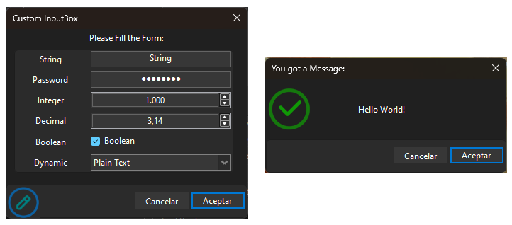

# Dark-Mode-Forms
Apply Dark Mode to all Controls in a Form [WinForms]


- This will detect if dark mode color is enabled in Windows settings.
- Then iterate all the controls on your form and try to convert them to DarkMode (if enabled).
- [Optional] If you have icons on your menus or toolbars, they will be recolored to give you a lighter, more visible-in-the-dark version of your icons. (Works best with monochrome icons)
- You can access Windows Dark Colors and use them for whatever you need.

# Now with Dark Messenger
Added a [Messenger.cs](Messenger.cs) class that allowes the user to popup Messages and InputBoxes:
-  ```Messenger.MesageBox``` is a Direct replacement for the old ```MessageBox.Show```, the new one applies Windows's Dark Mode automaticaly.
-  ```Messenger.InputBox``` is a replacement for VisualBasic's InputBox, implemented for C# and with extended functionalities:
	-  In its simplies form, you ask the user for a Text Input, then you use that for whatever you need
 	-  But Messenger.InputBox allowes you to promt the user with many more 'Fields' of different types:

- Button Texts are automatically translated to 5 Languages: ```en, es, de, fr, ru```.
- DarkMode doesnt require the Messenger but Messenger does require DarkMode.

MesageBox:
```csharp
try
{
	if (Messenger.MesageBox("Hello World!", "You got a Message:", 
		MessageBoxButtons.OKCancel, MessageBoxIcon.Exclamation) == DialogResult.OK)
	{
		//Do Something here.
	}
}
catch (Exception ex)
{
	Messenger.MesageBox(ex);
}
```
InputBox:
```csharp
// Definition of a Single Field:
var DarkMode = new KeyValue("Boolean", "true", KeyValue.ValueTypes.Boolean);

// Can Validate User Inputs on the Field:
DarkMode.Validate += (object? _control, KeyValue.ValidateEventArgs _e) =>
{
	string OldValue = _e.OldValue;
	if (_e.NewValue == "False")
	{
		//_e.Cancel = true; //<- CAN CANCEL THE MODIFICATION
		_e.ErrorText = "No puede ser Falso!";
	}
};
			
// Custom Types for 'Dynamic' Fields:
List<KeyValue> Dtypes = new List<KeyValue>
{
	new KeyValue("RichText Format", "0"),
	new KeyValue("Plain Text",      "1"),
	new KeyValue("AccountManager",  "2")
};

// Definition of Multiple Fields:
List<KeyValue> _Fields = new List<KeyValue>
{
	new KeyValue("String",  "String",   KeyValue.ValueTypes.String),
	new KeyValue("Password","Password", KeyValue.ValueTypes.Password),
	new KeyValue("Integer", "1000",     KeyValue.ValueTypes.Integer),
	new KeyValue("Decimal", "3,141638", KeyValue.ValueTypes.Decimal),
	DarkMode,
	new KeyValue("Dynamic", "1",        KeyValue.ValueTypes.Dynamic, Dtypes),
};

// Dialog Show:
if (Messenger.InputBox("Custom InputBox", "Please Fill the Form:", ref _Fields,
	Base64Icons.MsgIcon.Edit, MessageBoxButtons.OKCancel) == DialogResult.OK)
{
	Debug.WriteLine(string.Format("The New Password is: '{0}'", _Fields[0].Value));
}
```
# Implementation
- No Nuggets, No external DLLs, Just 1 File: [DarkModeCS.cs](DarkModeCS.cs) Copy/Paste or Download and import it into your project.
- 2 Lines to implement it:

```csharp
private DarkModeCS DM = null; //<- Line 1
....
public Form1()
{
	InitializeComponent();
	DM = new DarkModeCS(this); //<- Line 2
}
```
# Dark Mode Colors


# Framework Compatibility
- .NET 4.8+
- .NET 6.0+
- Core (untested)
- Some stuff may only work on Windows 11+

# Limitations
There are a few Winforms Controls that are, by design, extremely hard to theme:
- ComboBox:   Borders & Dropdown Button look too white.  You could use [FlatComboBox](Example/DarkModeForms/FlatComboBox.cs) instead, check in the Example.
- TabControl: 90% themed, a white border around the selected tab still remains.  You could use [FlatTabControl](Example/DarkModeForms/FlatTabControl.cs) instead, check in the Example.
- MessageBox:  Can't be themed. You can use [Messenger](Messenger.cs) instead.
- DateTimePicker: Un-themed.
- MonthCalendar:  Un-themed.
- ProgressBar:    Un-themed.
